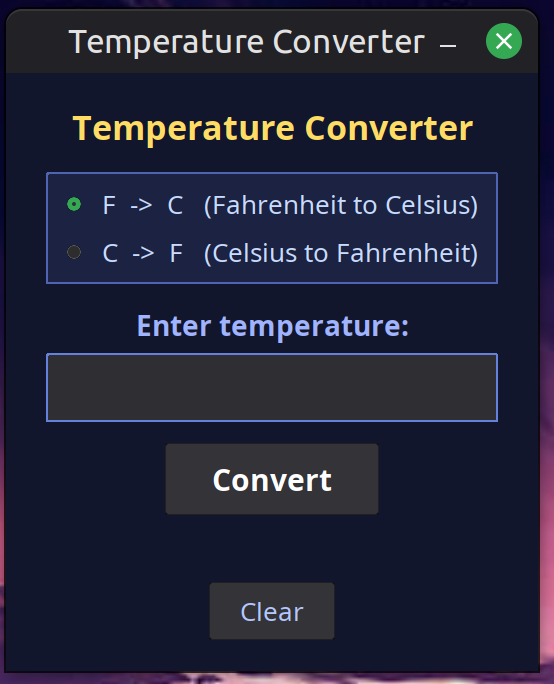

# Temperature Converter — Java Swing Teaching App

A beginner-friendly Java Swing desktop application that converts temperatures between Fahrenheit and Celsius. The source code is written as a guided lesson, with every major section annotated to explain not just *what* the code does, but *why* it's written that way.

---

## Running the App

```bash
javac TemperatureConverter.java
java TemperatureConverter
```

Requires Java 8 or later. No external libraries needed — Swing is built into the JDK.

---

## What It Teaches

### 1. Java Swing Fundamentals
- What Swing is and how it differs from terminal programs
- The component/container model: every visual element (`JButton`, `JLabel`, etc.) lives inside a container (`JPanel`, `JFrame`)
- How to build and display a `JFrame` window from scratch

### 2. Classes and Inheritance
- Using `extends JFrame` to inherit window behavior without rewriting it
- The difference between `public`, `private`, and when to use each

### 3. Constructors
- What a constructor is and when it runs
- How to use it to initialize a window's title, close behavior, and size

### 4. Instance Variables vs. Local Variables
- Why shared UI components (`inputField`, `resultLabel`, etc.) are declared as fields outside any single method
- How variable scope determines what code can "see" a variable

### 5. Layout Managers
- `BoxLayout.Y_AXIS` — stacking components vertically
- `GridLayout` — arranging items in rows and columns
- `Box.createVerticalStrut()` — adding fixed spacing between components (Swing's equivalent of CSS margin)

### 6. Core Swing Components
| Component | Purpose |
|---|---|
| `JFrame` | The main application window |
| `JPanel` | Invisible container for grouping components |
| `JLabel` | Non-editable text display |
| `JTextField` | Single-line user text input |
| `JButton` | Clickable button |
| `JRadioButton` | Single-choice option selector |
| `ButtonGroup` | Enforces mutual exclusivity among radio buttons |

### 7. Styling and Theming
- Setting colors with `new Color(r, g, b)`
- Choosing fonts with `new Font(name, style, size)`
- Adding borders with `BorderFactory.createCompoundBorder()` and `LineBorder`
- Controlling cursor appearance with `Cursor.HAND_CURSOR`

### 8. Event Listeners and the Observer Pattern
- How Swing components fire "events" when the user interacts with them
- Writing an `ActionListener` to respond to button clicks and Enter key presses
- Using lambda expressions (`e -> convert()`) as a concise alternative to anonymous classes
- Using `MouseAdapter` to implement hover effects by overriding only the needed methods

### 9. Exception Handling
- Using `try-catch` to handle `NumberFormatException` gracefully
- Why `Double.parseDouble()` can throw an exception and how to recover from it
- Guard clauses — returning early to avoid deeply nested `if-else` logic

### 10. Math and Type Gotchas
- The Fahrenheit ↔ Celsius conversion formulas
- Why `5/9` returns `0` in Java (integer division) and why `5.0/9.0` is correct (double division)
- Formatting output with `String.format()` and the `%.2f` specifier

### 11. Software Design Principles
- **Separation of concerns** — keeping UI setup (`initComponents`) separate from business logic (`convert`)
- **DRY (Don't Repeat Yourself)** — extracting repeated code into a helper method (`showError`)
- **Method decomposition** — breaking a large task into small, focused, well-named methods

### 12. Swing Thread Safety
- Why all Swing code must run on the Event Dispatch Thread (EDT)
- How `SwingUtilities.invokeLater()` schedules code onto the EDT safely
- What can go wrong if you skip this step

---

## Conversion Formulas

```
Fahrenheit → Celsius:   C = (F - 32) × 5.0 / 9.0
Celsius → Fahrenheit:   F = (C × 9.0 / 5.0) + 32
```

---

## Suggested Learning Path

1. Read through the file top to bottom — each `LESSON:` comment block introduces a new concept.
2. Try changing font sizes, colors, or label text to get comfortable modifying the UI.
3. Add a third conversion mode (e.g. Kelvin) to practice extending an existing feature.
4. Refactor the conversion logic into a separate `TemperatureUtils` class to practice splitting code across files.
